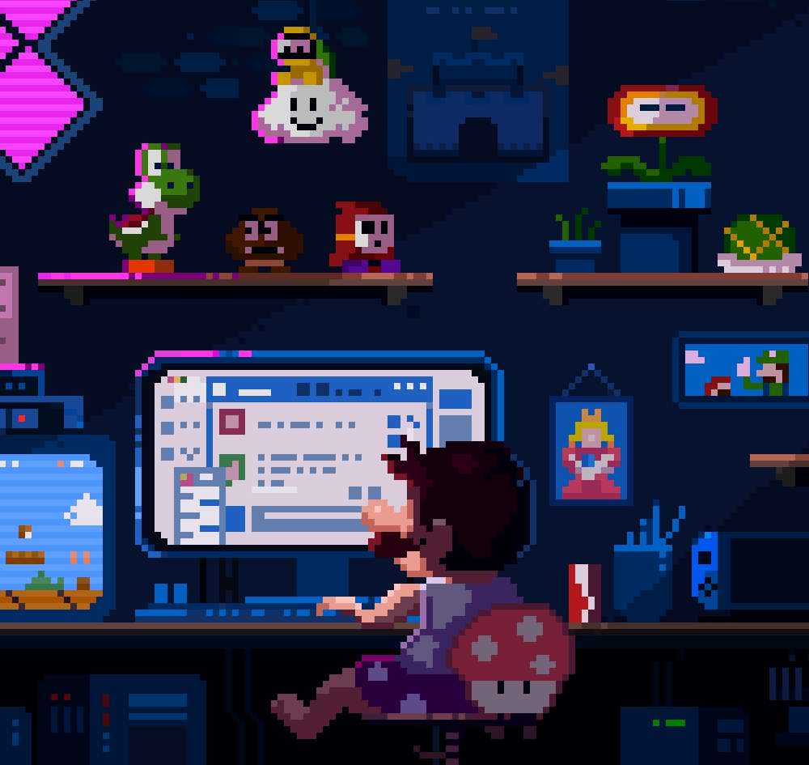

<br>

<div align="right">
    
</div>

<br>

<div align="center">
    
    
</div>

<br><br>

<table border="0" cellspacing="0" cellpadding="0">
  <tr>
    <td style="border: 0";>
      
    </td>
    <td style="border: 0";>
       <h1> Hey there!</h1>
    <div>
        </h1><div align="center">
        
    </div>
    </td>
  </tr>
</table>
        

<h3>About Me</h3>

```javascript
const Yash_bio = {
  I am : ["Web Developer", "OPEN SOURCE Dev", "Competitive Programming"],
  Code: [Javascript, CSS, Python, SQL],
  Tools & Tech: [HTML, Git, Linux],
  TechWork: {
          Competitive Programming: "Solving Problems",
    },

 challenge: "Currently I'm focused on React and Node"
}
```
<br/>
<br/>


<h3>My Contacts</h3>
<div align="center"> 
    <a href="https://twitter.com/yash_dayani"></a>&nbsp;
    <a href="https://instagram.com/yash.dayani"></a>&nbsp;
    <a href="https://www.linkedin.com/in/yashday/"></a>&nbsp;
    <a href="mailto:yashdayani0@gmail.com?cc=yash4work+viaGithub@proton.me&subject=Hello%20Yash!"></a>&nbsp;
    <a href="https://codepen.io/YashDayani/pens/public"></a>&nbsp;
</div>

<br/>
<h2></h2>
<br/>


<h3>My Skills</h3>
<ol type="I">
    <li><h3>Languages</h3> <br>
        <!-- Languages -->
        <div align="center"> 
            
            
            
            
        </div>
    </li>
    <li><h3>Databases</h3> <br>
        <!-- Database -->
        <div align="center">
            
            
        </div> 
<!-- Frameworks -->
<!-- Tools -->
<!-- OS  -->


<br/>
<h2></h2>
<br/>


<h3>My Contributions</h3>


<br/>
<h2></h2>
<br/>


<h3>My Stats</h3>
<br>

<!--START_SECTION:waka-->


**🐱 My GitHub Data** 

> 📦 54.4 kB Used in GitHub's Storage 
 > 
> 🚫 Not Opted to Hire
 > 
> 📜 7 Public Repositories 
 > 
> 🔑 2 Private Repositories 
 > 
**I'm an Early 🐤** 

```text
🌞 Morning                63 commits          ████████░░░░░░░░░░░░░░░░░   30.00 % 
🌆 Daytime                57 commits          ███████░░░░░░░░░░░░░░░░░░   27.14 % 
🌃 Evening                90 commits          ███████████░░░░░░░░░░░░░░   42.86 % 
🌙 Night                  0 commits           ░░░░░░░░░░░░░░░░░░░░░░░░░   00.00 % 
```
📅 **I'm Most Productive on Thursday** 

```text
Monday                   9 commits           █░░░░░░░░░░░░░░░░░░░░░░░░   04.29 % 
Tuesday                  7 commits           █░░░░░░░░░░░░░░░░░░░░░░░░   03.33 % 
Wednesday                13 commits          ██░░░░░░░░░░░░░░░░░░░░░░░   06.19 % 
Thursday                 84 commits          ██████████░░░░░░░░░░░░░░░   40.00 % 
Friday                   76 commits          █████████░░░░░░░░░░░░░░░░   36.19 % 
Saturday                 9 commits           █░░░░░░░░░░░░░░░░░░░░░░░░   04.29 % 
Sunday                   12 commits          █░░░░░░░░░░░░░░░░░░░░░░░░   05.71 % 
```


📊 **This Week I Spent My Time On** 

```text
🕑︎ Time Zone: Asia/Kolkata

💬 Programming Languages: 
CSS                      13 hrs 7 mins       ███████████░░░░░░░░░░░░░░   43.87 % 
JavaScript               8 hrs 21 mins       ███████░░░░░░░░░░░░░░░░░░   27.93 % 
HTML                     5 hrs 55 mins       █████░░░░░░░░░░░░░░░░░░░░   19.80 % 
JSON                     1 hr 20 mins        █░░░░░░░░░░░░░░░░░░░░░░░░   04.51 % 
Other                    46 mins             █░░░░░░░░░░░░░░░░░░░░░░░░   02.60 % 

🔥 Editors: 
VS Code                  29 hrs 54 mins      █████████████████████████   100.00 % 

🐱‍💻 Projects: 
SVG-Grabber              14 hrs 58 mins      █████████████░░░░░░░░░░░░   50.09 % 
Learning                 8 hrs 42 mins       ███████░░░░░░░░░░░░░░░░░░   29.09 % 
HTML & CSS               3 hrs 52 mins       ███░░░░░░░░░░░░░░░░░░░░░░   12.98 % 
Website                  1 hr 42 mins        █░░░░░░░░░░░░░░░░░░░░░░░░   05.70 % 
Unknown Project          25 mins             ░░░░░░░░░░░░░░░░░░░░░░░░░   01.43 % 

💻 Operating System: 
Windows                  29 hrs 54 mins      █████████████████████████   100.00 % 
```

**I Mostly Code in HTML** 

```text
HTML                     2 repos             █████████████████░░░░░░░░   66.67 % 
JavaScript               1 repo              ████████░░░░░░░░░░░░░░░░░   33.33 % 
```


 Last Updated on 08/05/2024 18:36:47 UTC
<!--END_SECTION:waka-->

<br>
<div align=center>
  <p align="center">
  
  
  
  <br>
  <br>

<!-- <p align="center">
  
  
</p> -->


<a href="#" align='left'>
<br>
</a>
