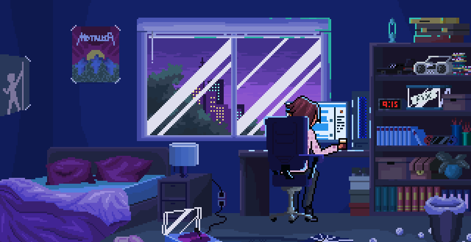
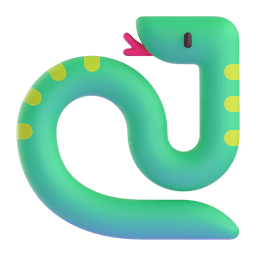

<div align="center">
    <h1>Hi 👋, I Am Yash Dayani <br> </h1><br>
</div>

<br>
        

<h3>About Me</h3>

```javascript
const Yash_bio = {
  I am : ["Front-End Web Developer", "OPEN SOURCE Dev", "Competitive Programming"],
  Code: [Javascript, CSS, Python, SQL],
  Tools & Tech: [HTML, Git, Linux],
  TechWork: {
          Competitive Programming: "Solving Problems",
    },

 challenge: "Currently I'm focused on React and Node"
}
```

<br/>
 
<br/>
<br/>


<h3>My Contacts</h3>
<div align="center"> 
    <a href="https://twitter.com/yash_dayani"></a>&nbsp;
    <a href="https://instagram.com/yash.dayani"></a>&nbsp;
    <a href="https://www.linkedin.com/in/yashday/"></a>&nbsp;
    <a href="mailto:yashdayani0@gmail.com?cc=yash4work+viaGithub@proton.me&subject=Hello%20Yash!"></a>&nbsp;
    <a href="https://codepen.io/YashDayani/pens/public"></a>&nbsp;
</div>

<br/>
<h2></h2>
<br/>


<h3>My Skills</h3>
<ol type="I">
    <li><h3>Languages</h3> <br>
        <!-- Languages -->
        <div align="center"> 
            
            
            
            
        </div>
    </li>
    <li><h3>Databases</h3> <br>
        <!-- Database -->
        <div align="center">
            
            
        </div> 
<!-- Frameworks -->
<!-- Tools -->
<!-- OS  -->

<br/>
<h2></h2>
<br/>


<h3>My Contributions</h3>


<br/>
<h2></h2>
<br/>


<h3>My Stats</h3>
<br>

<!--START_SECTION:waka-->


**🐱 My GitHub Data** 

> 📦 135.8 kB Used in GitHub's Storage 
 > 
> 🚫 Not Opted to Hire
 > 
> 📜 9 Public Repositories 
 > 
> 🔑 4 Private Repositories 
 > 
**I'm an Early 🐤** 

```text
🌞 Morning                126 commits         ████████░░░░░░░░░░░░░░░░░   30.58 % 
🌆 Daytime                116 commits         ███████░░░░░░░░░░░░░░░░░░   28.16 % 
🌃 Evening                169 commits         ██████████░░░░░░░░░░░░░░░   41.02 % 
🌙 Night                  1 commits           ░░░░░░░░░░░░░░░░░░░░░░░░░   00.24 % 
```
📅 **I'm Most Productive on Thursday** 

```text
Monday                   44 commits          ███░░░░░░░░░░░░░░░░░░░░░░   10.68 % 
Tuesday                  47 commits          ███░░░░░░░░░░░░░░░░░░░░░░   11.41 % 
Wednesday                57 commits          ███░░░░░░░░░░░░░░░░░░░░░░   13.83 % 
Thursday                 111 commits         ███████░░░░░░░░░░░░░░░░░░   26.94 % 
Friday                   103 commits         ██████░░░░░░░░░░░░░░░░░░░   25.00 % 
Saturday                 31 commits          ██░░░░░░░░░░░░░░░░░░░░░░░   07.52 % 
Sunday                   19 commits          █░░░░░░░░░░░░░░░░░░░░░░░░   04.61 % 
```


📊 **This Week I Spent My Time On** 

```text
🕑︎ Time Zone: Asia/Kolkata

💬 Programming Languages: 
JavaScript               8 hrs 41 mins       ███████████████████████░░   92.55 % 
JSON                     13 mins             █░░░░░░░░░░░░░░░░░░░░░░░░   02.44 % 
CSS                      13 mins             █░░░░░░░░░░░░░░░░░░░░░░░░   02.41 % 
Image (svg)              7 mins              ░░░░░░░░░░░░░░░░░░░░░░░░░   01.39 % 
Bash                     6 mins              ░░░░░░░░░░░░░░░░░░░░░░░░░   01.21 % 

🔥 Editors: 
VS Code                  8 hrs 27 mins       ██████████████████████░░░   90.00 % 
Cursor                   56 mins             ██░░░░░░░░░░░░░░░░░░░░░░░   10.00 % 

🐱‍💻 Projects: 
Weather App              9 hrs 21 mins       █████████████████████████   99.55 % 
React-Projects           2 mins              ░░░░░░░░░░░░░░░░░░░░░░░░░   00.45 % 

💻 Operating System: 
Windows                  9 hrs 23 mins       █████████████████████████   100.00 % 
```

**I Mostly Code in JavaScript** 

```text
JavaScript               5 repos             ████████████████░░░░░░░░░   62.50 % 
HTML                     2 repos             ██████░░░░░░░░░░░░░░░░░░░   25.00 % 
CSS                      1 repo              ███░░░░░░░░░░░░░░░░░░░░░░   12.50 % 
```


 Last Updated on 14/12/2024 18:43:28 UTC
<!--END_SECTION:waka-->

<br>

<div align=center>
  <p align="center">
  
  
  
  <br>
  <br>

<!-- <p align="center">
  
  
</p> -->

<a href="#" align='left'></a>

<br>

<a href="#" align='left'></a>
