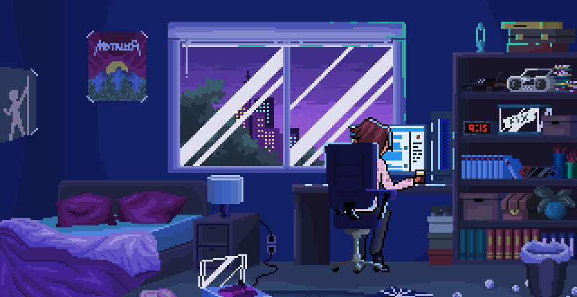
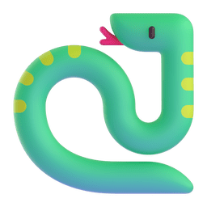

<div align="center">
    <h1>Hi 👋, I Am Yash Dayani <br> </h1><br>
</div>

<br>
        

<h3>About Me</h3>

```javascript
const Yash_bio = {
  "I am": [
    "Yash Dayani, a web developer dedicated to crafting seamless and engaging digital experiences."
  ],
  "Code": [
    "JavaScript",
    "TypeScript",
    "CSS",
    "Python",
    "MongoDB",
    "Express",
    "React",
    "Node.js"
  ],
  "Tools & Tech": [
    "HTML",
    "Git",
    "Linux"
  ],
  "TechWork": {
    "Frontend Development": "Building responsive UIs with React, Tailwind CSS, and component libraries like ShadCN UI",
    "Backend Development": "Creating RESTful APIs using Node.js and Express",
    "Full-Stack Projects": "Building end-to-end applications using the MERN stack"
  },
  "Challenge": "Currently focused on mastering Next.js and building scalable full-stack applications with TypeScript."
}
```

<br/>
 
<br/>
<br/>


<h3>My Contacts</h3>
<div align="center"> 
    <a href="https://twitter.com/yash_dayani"></a>&nbsp;
    <a href="https://instagram.com/yash.dayani"></a>&nbsp;
    <a href="https://www.linkedin.com/in/yashday/"></a>&nbsp;
    <a href="mailto:yashdayani0@gmail.com?cc=yash4work+viaGithub@proton.me&subject=Hello%20Yash!"></a>&nbsp;
</div>

<br/>
<h2></h2>
<br/>


<h3>My Skills</h3>
<ol type="I">
    <li><h3>Languages</h3> <br>
        <!-- Languages -->
        <div align="center"> 
            
            
            
            
        </div>
    </li>
<!-- Frameworks -->
<!-- Tools -->
<!-- OS  -->

<br/>
<h2></h2>
<br/>


<h3>My Contributions</h3>


<br/>
<h2></h2>
<br/>


<h3>My Stats</h3>
<br>

<!--START_SECTION:waka-->


**🐱 My GitHub Data** 

> 📦 216.8 kB Used in GitHub's Storage 
 > 
> 🏆 49 Contributions in the Year 2026
 > 
> 🚫 Not Opted to Hire
 > 
> 📜 22 Public Repositories 
 > 
> 🔑 19 Private Repositories 
 > 
**I'm an Early 🐤** 

```text
🌞 Morning                299 commits         ████░░░░░░░░░░░░░░░░░░░░░   16.57 % 
🌆 Daytime                658 commits         █████████░░░░░░░░░░░░░░░░   36.45 % 
🌃 Evening                663 commits         █████████░░░░░░░░░░░░░░░░   36.73 % 
🌙 Night                  185 commits         ███░░░░░░░░░░░░░░░░░░░░░░   10.25 % 
```
📅 **I'm Most Productive on Saturday** 

```text
Monday                   120 commits         ██░░░░░░░░░░░░░░░░░░░░░░░   06.65 % 
Tuesday                  165 commits         ██░░░░░░░░░░░░░░░░░░░░░░░   09.14 % 
Wednesday                192 commits         ███░░░░░░░░░░░░░░░░░░░░░░   10.64 % 
Thursday                 369 commits         █████░░░░░░░░░░░░░░░░░░░░   20.44 % 
Friday                   277 commits         ████░░░░░░░░░░░░░░░░░░░░░   15.35 % 
Saturday                 476 commits         ███████░░░░░░░░░░░░░░░░░░   26.37 % 
Sunday                   206 commits         ███░░░░░░░░░░░░░░░░░░░░░░   11.41 % 
```


📊 **This Week I Spent My Time On** 

```text
🕑︎ Time Zone: Asia/Kolkata

💬 Programming Languages: 
No Activity Tracked This Week

🔥 Editors: 
No Activity Tracked This Week

🐱‍💻 Projects: 
No Activity Tracked This Week

💻 Operating System: 
No Activity Tracked This Week
```

**I Mostly Code in JavaScript** 

```text
JavaScript               15 repos            ███████████░░░░░░░░░░░░░░   42.86 % 
TypeScript               14 repos            ██████████░░░░░░░░░░░░░░░   40.00 % 
MDX                      1 repo              █░░░░░░░░░░░░░░░░░░░░░░░░   02.86 % 
PHP                      1 repo              █░░░░░░░░░░░░░░░░░░░░░░░░   02.86 % 
Svelte                   1 repo              █░░░░░░░░░░░░░░░░░░░░░░░░   02.86 % 
```


 Last Updated on 28/03/2026 19:06:48 UTC
<!--END_SECTION:waka-->

<br>

<div align="center"> 
    
</div>


