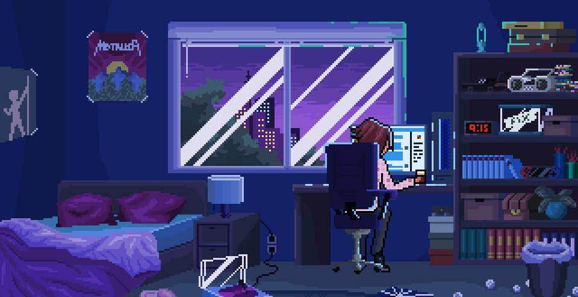
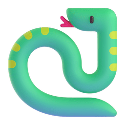

<div align="center">
    <h1>Hi 👋, I Am Yash Dayani <br> </h1><br>
</div>

<br>
        

<h3>About Me</h3>

```javascript
const Yash_bio = {
  "I am": [
    "Yash Dayani, a web developer dedicated to crafting seamless and engaging digital experiences."
  ],
  "Code": [
    "JavaScript",
    "TypeScript",
    "CSS",
    "Python",
    "MongoDB",
    "Express",
    "React",
    "Node.js"
  ],
  "Tools & Tech": [
    "HTML",
    "Git",
    "Linux"
  ],
  "TechWork": {
    "Frontend Development": "Building responsive UIs with React, Tailwind CSS, and component libraries like ShadCN UI",
    "Backend Development": "Creating RESTful APIs using Node.js and Express",
    "Full-Stack Projects": "Building end-to-end applications using the MERN stack"
  },
  "Challenge": "Currently focused on mastering Next.js and building scalable full-stack applications with TypeScript."
}
```

<br/>
 
<br/>
<br/>


<h3>My Contacts</h3>
<div align="center"> 
    <a href="https://twitter.com/yash_dayani"></a>&nbsp;
    <a href="https://instagram.com/yash.dayani"></a>&nbsp;
    <a href="https://www.linkedin.com/in/yashday/"></a>&nbsp;
    <a href="mailto:yashdayani0@gmail.com?cc=yash4work+viaGithub@proton.me&subject=Hello%20Yash!"></a>&nbsp;
</div>

<br/>
<h2></h2>
<br/>


<h3>My Skills</h3>
<ol type="I">
    <li><h3>Languages</h3> <br>
        <!-- Languages -->
        <div align="center"> 
            
            
            
            
        </div>
    </li>
<!-- Frameworks -->
<!-- Tools -->
<!-- OS  -->

<br/>
<h2></h2>
<br/>


<h3>My Contributions</h3>


<br/>
<h2></h2>
<br/>


<h3>My Stats</h3>
<br>

<!--START_SECTION:waka-->


**🐱 My GitHub Data** 

> 📦 217.2 kB Used in GitHub's Storage 
 > 
> 🏆 57 Contributions in the Year 2026
 > 
> 🚫 Not Opted to Hire
 > 
> 📜 24 Public Repositories 
 > 
> 🔑 20 Private Repositories 
 > 
**I'm an Early 🐤** 

```text
🌞 Morning                299 commits         ████░░░░░░░░░░░░░░░░░░░░░   16.53 % 
🌆 Daytime                659 commits         █████████░░░░░░░░░░░░░░░░   36.43 % 
🌃 Evening                666 commits         █████████░░░░░░░░░░░░░░░░   36.82 % 
🌙 Night                  185 commits         ███░░░░░░░░░░░░░░░░░░░░░░   10.23 % 
```
📅 **I'm Most Productive on Saturday** 

```text
Monday                   120 commits         ██░░░░░░░░░░░░░░░░░░░░░░░   06.63 % 
Tuesday                  165 commits         ██░░░░░░░░░░░░░░░░░░░░░░░   09.12 % 
Wednesday                192 commits         ███░░░░░░░░░░░░░░░░░░░░░░   10.61 % 
Thursday                 370 commits         █████░░░░░░░░░░░░░░░░░░░░   20.45 % 
Friday                   279 commits         ████░░░░░░░░░░░░░░░░░░░░░   15.42 % 
Saturday                 476 commits         ███████░░░░░░░░░░░░░░░░░░   26.31 % 
Sunday                   207 commits         ███░░░░░░░░░░░░░░░░░░░░░░   11.44 % 
```


📊 **This Week I Spent My Time On** 

```text
🕑︎ Time Zone: Asia/Kolkata

💬 Programming Languages: 
Markdown                 4 hrs 10 mins       ████████████████░░░░░░░░░   65.82 % 
TypeScript               1 hr 2 mins         ████░░░░░░░░░░░░░░░░░░░░░   16.37 % 
JavaScript               44 mins             ███░░░░░░░░░░░░░░░░░░░░░░   11.74 % 
Python                   15 mins             █░░░░░░░░░░░░░░░░░░░░░░░░   04.11 % 
JSON                     3 mins              ░░░░░░░░░░░░░░░░░░░░░░░░░   01.00 % 

🔥 Editors: 
Claude Code              6 hrs 6 mins        ████████████████████████░   96.26 % 
VS Code                  14 mins             █░░░░░░░░░░░░░░░░░░░░░░░░   03.74 % 

🐱‍💻 Projects: 
Hobbo-API                2 hrs 51 mins       ███████████░░░░░░░░░░░░░░   45.01 % 
Feedspace-Frontend-Nextjs2 hrs 28 mins       ██████████░░░░░░░░░░░░░░░   38.98 % 
raw                      27 mins             ██░░░░░░░░░░░░░░░░░░░░░░░   07.25 % 
Feedspace SEO            16 mins             █░░░░░░░░░░░░░░░░░░░░░░░░   04.41 % 
feedspace.io-audit       8 mins              █░░░░░░░░░░░░░░░░░░░░░░░░   02.28 % 

💻 Operating System: 
Mac                      6 hrs 20 mins       █████████████████████████   100.00 % 
```

🤖 **AI Coding This Week** 

```text
⏱ AI Coding Time: 6 hrs 19 mins (99.57%)

✍️ 6,266 lines written by AI, 0 lines written by hand (100.0% AI-written)

🔤 163,323,267 Input Tokens, 639,758 Output Tokens

💵 $808.88 Estimated AI Cost This Week

🧠 17 AI Sessions, 44 AI Prompts

Opus                     6,410 lines         █████████████████████████   100.00 % 
Sonnet                   0 lines             ░░░░░░░░░░░░░░░░░░░░░░░░░   00.00 % 
Claude-Code              0 lines             ░░░░░░░░░░░░░░░░░░░░░░░░░   00.00 % 
GPT                      0 lines             ░░░░░░░░░░░░░░░░░░░░░░░░░   00.00 % 

🔎 AI Coding Insights:
🤖 AI-Driven — 100.0% of written lines came from AI
📚 Verbose Prompter — average 3,400 characters per prompt
🔁 Iterative Prompter — average 3 prompts per session
🚀 High AI Trust — 0.0% of changed lines were hand-edited
```

**I Mostly Code in TypeScript** 

```text
TypeScript               16 repos            ███████████░░░░░░░░░░░░░░   42.11 % 
JavaScript               16 repos            ███████████░░░░░░░░░░░░░░   42.11 % 
MDX                      1 repo              █░░░░░░░░░░░░░░░░░░░░░░░░   02.63 % 
PHP                      1 repo              █░░░░░░░░░░░░░░░░░░░░░░░░   02.63 % 
Svelte                   1 repo              █░░░░░░░░░░░░░░░░░░░░░░░░   02.63 % 
```


 Last Updated on 15/08/2026 18:56:18 UTC
<!--END_SECTION:waka-->

<br>

<div align="center"> 
    
</div>


