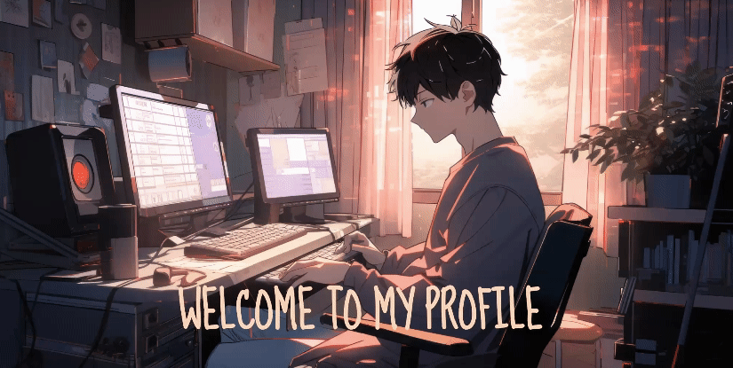

<h1 align="center">Hi there👋🏻</h1>
</h1>

<table border="0" cellspacing="0" cellpadding="0">
  <tr>
    <td style="border: 0";>
      
    </td>
    <td style="border: 0";>
      <h1 align="left">:wave: Hello there!
    </h1>

      

    </td>
  </tr>
</table>

    
    

<h1 align="center">
    
</h1>

<h3 align="center">A passionate web developer from India </h3>

 

 
 🔭 I’m currently working on **a marketplace**
 
 🌱 I’m currently learning **Docker, Supabase, AWS**

💬 Ask me about **Node.js, React, Firebase... or anything [here](https://github.com/salesp07/salesp07/issues)**

⚡ Fun fact **Game of Thrones Night's Watch cloaks are made from Ikea rugs**

 

 

 
  
  
  <a href="https://salesp07.github.io" target="_blank">
      <!-- sqlite, safari, google-chrome are other good icon options -->
  </a>

 

 
<h2 align="center">⚒️ Languages-Frameworks-Tools ⚒️</h2>
 

    
     

 

  <h2>🐍 My Contributions 🐍</h2>
   
  
  
     

<h2 align="center">⚡ Stats ⚡</h2>
 

  

  
  
  
   
   
  

<!-- 

  
  

 -->

<!--

  

 
